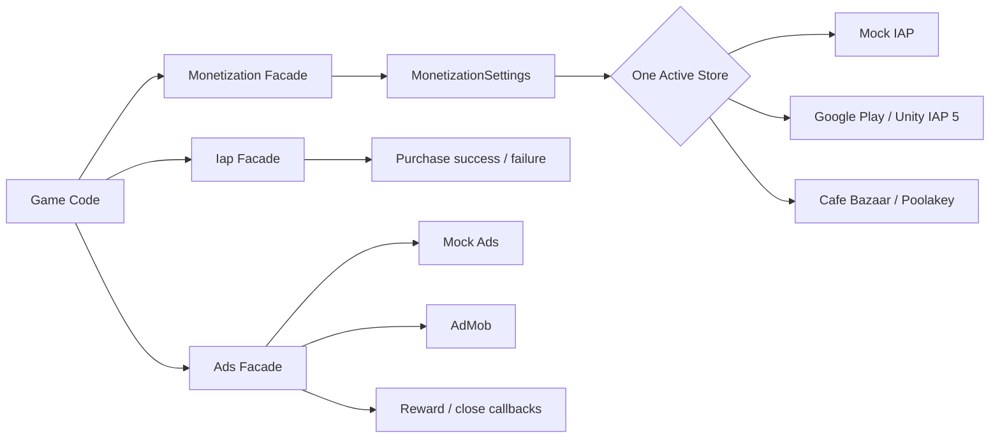

<div align="center">

# 💰 Unity Monetization Framework v2

### A production-focused monetization layer for Unity 6

**Mock-first development • Unity IAP 5.4.3 • Google Play • Cafe Bazaar Poolakey • AdMob**

[](#requirements)
[](com.aminhasanloo.monetization/CHANGELOG.md)
[](#google-play-iap)
[](https://github.com/AminHasanloo/UnityMonetizationFramework/actions/workflows/package-sanity.yml)
[](LICENSE)

**Built by [Amin Hasanloo](https://github.com/AminHasanloo)**

</div>

---

## Why this rewrite exists

The original package had the right goal, one game-side API for several stores and ad networks, but it had accumulated implementation problems that made it unsafe to call production-ready.

v2 rebuilds the core around a simple rule:

> **If an integration is not genuinely implemented against the current SDK contract, it must fail clearly instead of pretending to work.**

The rewrite fixes provider overwrite races, event subscription loss, missing auto-startup, stale Unity IAP and AdMob APIs, fake Cafe Bazaar/Myket shims, an insecure client-side Zarinpal flow, and obsolete IronSource/Tapsell assumptions.

---

## ✅ What works in v2.0

| Provider / feature | Implementation | Validation state |
|---|---:|---:|
| **Mock IAP** | ✅ Ready | 🟦 Editor tests/dashboard included |
| **Mock Ads** | ✅ Ready | 🟦 Editor tests/dashboard included |
| **Google Play IAP** | ✅ Unity IAP 5.x `StoreController` | 🟡 Real store/device test required |
| **Cafe Bazaar** | ✅ Official Poolakey API binding | 🟡 Real Bazaar/device test required |
| **AdMob** | ✅ Current load/readiness/show lifecycle | 🟡 Test ad IDs on device required |
| **Single-store routing** | ✅ Ready | ✅ Static regression guard |
| **Typed product catalog** | ✅ Ready | 🟦 EditMode tests included |
| **Auto initialization** | ✅ Ready | 🟦 Validation Dashboard included |
| **Myket** | 🧭 Planned | 🔒 Not advertised as ready |
| **Tapsell Plus** | 🧭 Planned | 🔒 Not advertised as ready |
| **Unity LevelPlay** | 🧭 Planned | 🔒 Not advertised as ready |
| **Zarinpal** | 🔒 Backend roadmap | 🔒 Unsafe client flow removed |

> External store/ad flows still require the vendor's official SDK, dashboard setup, test account/IDs and **real-device/store validation**. This repository never treats compile success as proof of a valid financial integration.

---

## 🧪 Validation Pack

v2.0 now ships with a dedicated validation layer instead of relying on manual guesswork.

### Included

- **EditMode core tests** for product mapping, v1 catalog migration, Mock IAP success/failure and Mock rewarded callbacks.
- **Validation Dashboard sample** for initialize, purchase, restore, rewarded, interstitial and banner flows.
- **Validation Scene Builder** at `Tools > Monetization > Create Validation Scene`.
- **Provider validation issue form** for recording Unity version, SDK version, device, environment and evidence.
- **Release checklist** that blocks a stable label until advertised providers have evidence.
- **Package Sanity CI** that guards metadata, retired v1 code and Validation Pack files.

Full protocol: **[VALIDATION.md](VALIDATION.md)**  
Stable release gate: **[RELEASE_CHECKLIST.md](RELEASE_CHECKLIST.md)**

### Confidence legend

| Mark | Meaning |
|---|---|
| ✅ | Evidence passed in CI or a recorded test |
| 🟦 | Test/tool is included and ready to run |
| 🟡 | Official SDK/account/device validation is still required |
| 🔒 | Intentionally unavailable in v2.0 |

---

## Core improvements

- One explicit `activeStore`, so multiple compile symbols cannot silently replace each other.
- `Monetization.InitializeAsync()` always performs explicit initialization.
- Real automatic startup when `initializeOnStartup` is enabled.
- IAP event listeners can be registered **before** initialization and are retained.
- Async restore flow with `Iap.RestoreAsync()`.
- Stable canonical product IDs plus per-store overrides.
- Mock services make shop UI, reward logic and purchase events testable in Editor.
- Unsupported legacy integrations are not auto-enabled by the settings window.
- Obsolete Android proxy/deep-link shims were removed so official SDKs own their Android dependencies.

---

## Architecture



The public game-side API remains small while SDK-specific code stays behind providers/adapters.

---

## Requirements

- **Unity 6 / 6000.0+**
- `com.unity.purchasing` **5.4.3**, declared by the package
- Android for Cafe Bazaar and the current Iran-focused store workflows
- Official external SDK only when the corresponding adapter is enabled

---

## Installation

### Unity Package Manager, Git URL

```text
https://github.com/AminHasanloo/UnityMonetizationFramework.git?path=/com.aminhasanloo.monetization
```

Or add to `Packages/manifest.json`:

```json
{
  "dependencies": {
    "com.aminhasanloo.monetization": "https://github.com/AminHasanloo/UnityMonetizationFramework.git?path=/com.aminhasanloo.monetization"
  }
}
```

After a stable GitHub tag is validated, prefer pinning that tag instead of tracking `main`.

---

## 60-second Editor test

1. Open **Window → Monetization → Settings**.
2. Click **Create Settings Asset**.
3. Keep `Active Store = Mock`.
4. Keep `Use Mock Services In Editor = true`.
5. Add `coins_100` as a Consumable product.
6. Import **Validation Dashboard** from Package Manager.
7. Run **Tools → Monetization → Create Validation Scene**.
8. Enter Play Mode and exercise the buttons.

Or initialize directly:

```csharp
using AminHasanloo.Monetization;
using AminHasanloo.Monetization.Ads;
using AminHasanloo.Monetization.IAP;
using UnityEngine;

public class ShopExample : MonoBehaviour
{
    async void Start()
    {
        Iap.OnPurchaseSucceeded += id => Debug.Log($"Purchased: {id}");
        Iap.OnPurchaseFailed += (id, error) => Debug.LogError($"{id}: {error}");

        await Monetization.InitializeAsync();
        Ads.Load(AdType.Rewarded, "reward_default");
    }

    public void BuyCoins() => Iap.Purchase("coins_100");

    public void ShowRewarded()
    {
        Ads.ShowRewarded("reward_default", reward =>
            Debug.Log($"Grant: {reward.Amount} {reward.Type}"));
    }
}
```

---

## Product catalog

Game code uses a stable canonical ID while stores can have different IDs:

| Field | Example |
|---|---|
| `id` | `coins_100` |
| `type` | `Consumable` |
| `googlePlayId` | `coins_100_gp` |
| `cafeBazaarId` | `coins_100_bazaar` |
| `myketId` | reserved for future adapter |

Supported product types:

```text
Consumable
NonConsumable
Subscription
```

Old v1 `productIds` are retained as a hidden migration field and are interpreted as consumables when the v2 catalog is empty.

---

## Google Play IAP

v2 uses the Unity IAP 5.x service model:

```text
StoreController
  → Connect
  → FetchProducts
  → FetchPurchases
  → PurchaseProduct
  → OnPurchasePending
  → ConfirmPurchase
```

Setup:

1. Set `Active Store = GooglePlay`.
2. Enable Google Play in settings.
3. Add products to the catalog.
4. Click **Apply Android Scripting Define Symbols**.
5. Build through a valid Google Play testing track/account.
6. Record the run with the **Provider validation report** issue form.

The adapter registers store, product-fetch, purchase-fetch and purchase-failure callbacks before requests are made.

### Fulfillment note

The default implementation confirms a pending order after the local success callback. That is practical for prototypes and low-risk local products, but **valuable virtual currency or competitive economies should be server-authoritative**. Verify the transaction, make the grant idempotent, persist it server-side, then confirm.

---

## Cafe Bazaar / Poolakey

The v1 dummy `BazaarIAB` classes are gone. v2 binds to the official Poolakey public API:

```text
PaymentConfiguration
Payment.Connect()
Payment.Purchase()
Payment.Consume()
Payment.GetPurchases()
```

Setup:

1. Install the official [Cafe Bazaar Poolakey Unity SDK](https://github.com/cafebazaar/PoolakeyUnitySdk).
2. Set `Active Store = CafeBazaar`.
3. Enable Cafe Bazaar.
4. Add the RSA public key if Poolakey security checking is used.
5. Configure product types and store IDs.
6. Apply Android scripting symbols.
7. Validate on a Bazaar-compatible test environment/device.
8. Record the evidence with the validation issue form.

Consumables may be auto-consumed. Restore re-delivers non-consumable and subscription entitlements.

---

## AdMob

The adapter follows the modern lifecycle:

```text
Load
  → CanShowAd
  → Show
  → Closed / Failed
  → Destroy used full-screen ad
  → Reload
```

Banner readiness is tracked from the actual load callback instead of treating object creation as a loaded ad.

Setup:

1. Install the current official Google Mobile Ads Unity plugin.
2. Enable AdMob.
3. Enter Banner, Interstitial and Rewarded Ad Unit IDs.
4. Apply Android scripting symbols.
5. Use Google's **test ad units** during validation.
6. Validate on device and record a provider validation report.

---

## Retired v1 integrations

### Tapsell Plus

The old adapter treated a zone ID as if it were the response ID returned by the current request flow. It is disabled until the proper `Request*Ad(zoneId) → responseId → Show*Ad(responseId)` lifecycle is implemented and device-tested.

### Unity LevelPlay / ironSource

The old `IronSource.Agent` path is retired. A modern LevelPlay Ad Unit implementation is planned for v2.1.

### Myket

The v1 provider contained placeholder methods. They were removed. `STORE_MYKET` is not enabled until a real official-SDK adapter exists.

### Zarinpal

The old implementation kept authoritative amount/verification logic in the game client. v2 removes that path. The future implementation is a backend-owned checkout and verification flow.

---

## Scripting symbols managed by v2.0

Supported by the Editor settings window:

```text
STORE_GOOGLEPLAY
STORE_CAFEBAZAAR
AD_ADMOB
```

Legacy/unvalidated symbols are removed instead of enabled:

```text
STORE_MYKET
PAY_ZARINPAL
AD_TAPSELL
AD_IRONSOURCE
AD_LEVELPLAY
```

---

## v1 → v2 fixes

| v1 problem | v2 solution |
|---|---|
| Multiple store providers could overwrite each other | One explicit `activeStore` |
| Manual init depended on `initializeOnStartup` | Explicit init always works |
| `initializeOnStartup` had no true bootstrap | Runtime bootstrap added |
| Early IAP subscriptions could be lost | Facade owns subscriptions |
| Flat string-only product IDs | Typed catalog + store overrides |
| Google Play used IAP v4 listener APIs | Rewritten for `StoreController` / IAP 5.x |
| AdMob mixed legacy/current APIs | Current load/show lifecycle |
| Bazaar dummy classes | Real Poolakey binding |
| Myket dummy classes | Removed, fail-fast roadmap guard |
| Insecure client Zarinpal verification | Removed, backend roadmap |
| Legacy IronSource API | Retired |
| Incorrect Tapsell zone/response handling | Retired pending proper adapter |
| Obsolete store proxy Android manifest | Removed |

---

## Security checklist

- Never ship payment gateway secrets in the client.
- Never trust client-owned prices for external payments.
- Use official store SDKs and test accounts.
- Make purchase fulfillment idempotent.
- Validate high-value purchases server-side.
- Persist server-authoritative entitlements before final acknowledgement where required.
- Use test ad IDs during development.
- Add consent/privacy handling appropriate to your regions and providers.
- Treat compile success as only one step, not proof of a valid financial integration.

---

## Repository structure

```text
.
├── .github/
│   ├── ISSUE_TEMPLATE/provider-validation.yml
│   └── workflows/package-sanity.yml
├── VALIDATION.md
├── RELEASE_CHECKLIST.md
└── com.aminhasanloo.monetization/
    ├── Runtime/
    │   ├── Ads/
    │   ├── IAP/
    │   └── Settings/
    ├── Editor/
    ├── Tests/Editor/
    ├── Samples~/Demo/
    ├── Samples~/Validation/
    ├── CHANGELOG.md
    └── package.json
```

---

## Contributing

Provider PRs should state:

- Unity version
- SDK/plugin version
- platform/device
- test account/environment
- purchase/ad formats actually tested
- required Android/iOS build configuration

For provider validation, use the repository's **Provider validation report** issue form. Never attach secrets or sensitive receipts.

---

## License

MIT

---

# 🗺️ Future Roadmap

The long-term goal is to keep **game-side monetization code stable** while store, ad and payment SDKs evolve underneath it.

### v2.1 • Complete current provider coverage
- [ ] Implement **Tapsell Plus** with the current response-ID lifecycle
- [ ] Implement **Unity LevelPlay** with the modern Init + Ad Unit APIs
- [ ] Implement the **official Myket Billing** adapter with purchase, consume and restore
- [ ] Add iOS App Store validation through Unity IAP 5.x
- [ ] Add per-platform provider selection

### v2.2 • Server-authoritative purchases
- [ ] Generic `IPurchaseVerifier` interface
- [ ] Google Play backend receipt/order verification example
- [ ] Cafe Bazaar backend verification example
- [ ] Secure **Zarinpal backend checkout** example
- [ ] Transaction ledger + idempotency keys
- [ ] Pending/deferred purchase state model
- [ ] Retry-safe fulfillment queue

### v2.3 • Ad orchestration
- [ ] Provider priority / waterfall configuration
- [ ] Automatic fallback on no-fill/load failure
- [ ] Placement frequency caps
- [ ] Cooldowns and session limits
- [ ] App Open Ads
- [ ] Adaptive banners / MREC
- [ ] Impression-level revenue callbacks
- [ ] Remote placement configuration

### v2.4 • Analytics & LiveOps
- [ ] Bridge to **Unity-Analytics-Lite**
- [ ] Firebase/custom analytics adapters
- [ ] Standardized purchase/ad revenue event schema
- [ ] ARPDAU and payer-conversion hooks
- [ ] Remote Config integration
- [ ] A/B test hooks
- [ ] Player segmentation and monetization rules

### v2.5 • Developer tooling
- [ ] Editor health dashboard for missing SDKs, IDs and symbols
- [ ] Automatic v1 → v2 migration assistant
- [x] Unity Test Framework coverage for the SDK-independent core and mock providers
- [x] Validation Dashboard + validation scene builder sample
- [x] Provider validation issue form + stable release checklist
- [ ] CI Unity compile/test matrix for supported Unity 6 versions
- [ ] Android build validation workflow
- [ ] Sample production-style shop UI
- [ ] GitHub Releases + immutable UPM tags
- [ ] Generated API documentation

### Longer term
- [ ] Server-driven economy catalog
- [ ] Subscription entitlement service
- [ ] Promotional offers and coupons
- [ ] Cross-store entitlements
- [ ] Fraud/risk signals
- [ ] Consent-management abstraction
- [ ] Monetization health dashboard inside Unity Editor
- [ ] Automated SDK compatibility checks and dependency upgrade PRs
