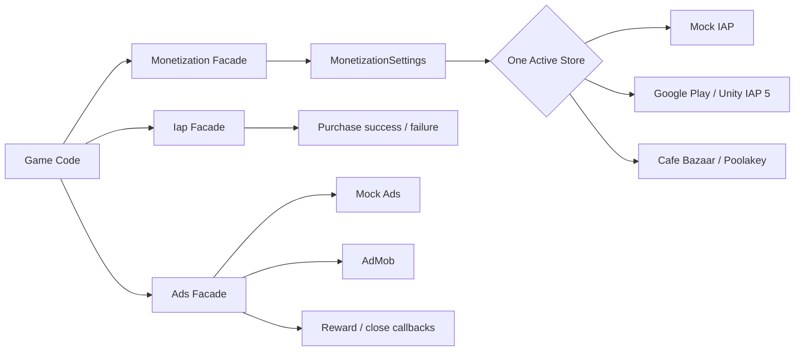

<div align="center">

# 💰 Unity Monetization Framework v2

### A production-focused monetization layer for Unity 6

**Mock-first development • Unity IAP 5.4.3 • Google Play • Cafe Bazaar Poolakey • AdMob**

[](#requirements)
[](com.aminhasanloo.monetization/CHANGELOG.md)
[](#google-play-iap)
[](LICENSE)

**Built by [Amin Hasanloo](https://github.com/AminHasanloo)**

</div>

---

## Why this rewrite exists

The original package had the right goal, one game-side API for several stores and ad networks, but it had accumulated implementation problems that made it unsafe to call production-ready.

v2 rebuilds the core around a simple rule:

> **If an integration is not genuinely implemented against the current SDK contract, it must fail clearly instead of pretending to work.**

The rewrite fixes provider overwrite races, event subscription loss, missing auto-startup, stale Unity IAP and AdMob APIs, fake Cafe Bazaar/Myket shims, an insecure client-side Zarinpal flow, and obsolete IronSource/Tapsell assumptions.

---

## ✅ What works in v2.0

| Provider / feature | Status | Details |
|---|---:|---|
| **Mock IAP** | ✅ Ready | Works immediately in Unity Editor |
| **Mock Ads** | ✅ Ready | Rewarded, interstitial and banner development flow |
| **Google Play IAP** | ✅ Rewritten | Unity IAP 5.x `StoreController` architecture |
| **Cafe Bazaar** | ✅ Rewritten | Binds to official Poolakey `Payment` API |
| **AdMob** | ✅ Rewritten | Current load / readiness / show lifecycle |
| **Single-store routing** | ✅ Ready | Exactly one active IAP provider |
| **Typed product catalog** | ✅ Ready | Consumable, non-consumable, subscription, store overrides |
| **Auto initialization** | ✅ Ready | `RuntimeInitializeOnLoadMethod` bootstrap |
| **Myket** | 🧭 Planned | Fake v1 shim removed |
| **Tapsell Plus** | 🧭 Planned | Old adapter retired, current response-ID flow required |
| **Unity LevelPlay** | 🧭 Planned | Legacy `IronSource.Agent` retired, LevelPlay 9+ Ad Unit API required |
| **Zarinpal** | 🔒 Backend roadmap | Unsafe client verification removed |

> External store/ad flows still require the vendor's official SDK, dashboard setup, test account/IDs and **real-device/store validation**. The core and Editor mock flow can be exercised without those services; this repository update does not claim a live financial transaction was executed from GitHub.

---

## Core improvements

- One explicit `activeStore`, so multiple compile symbols cannot silently replace each other.
- `Monetization.InitializeAsync()` always performs explicit initialization.
- Real automatic startup when `initializeOnStartup` is enabled.
- IAP event listeners can be registered **before** initialization and are retained.
- Async restore flow with `Iap.RestoreAsync()`.
- Stable canonical product IDs plus per-store overrides.
- Mock services make shop UI, reward logic and purchase events testable in Editor.
- Unsupported legacy integrations are not auto-enabled by the settings window.
- Obsolete Android manifest proxy/deep-link shims were removed. Official SDKs now own their Android manifests and dependencies.

---

## Architecture



The public API remains small while SDK-specific code stays behind adapters.

---

## Requirements

- **Unity 6 / 6000.0+**
- `com.unity.purchasing` **5.4.3**, declared by the package
- Android for Cafe Bazaar and the Iran-focused store integrations
- Official external SDK only when the corresponding adapter is enabled

---

## Installation

### Unity Package Manager, Git URL

```text
https://github.com/AminHasanloo/UnityMonetizationFramework.git?path=/com.aminhasanloo.monetization
```

Or add to `Packages/manifest.json`:

```json
{
  "dependencies": {
    "com.aminhasanloo.monetization": "https://github.com/AminHasanloo/UnityMonetizationFramework.git?path=/com.aminhasanloo.monetization"
  }
}
```

---

## 60-second Editor test

1. Open **Window → Monetization → Settings**.
2. Click **Create Settings Asset**.
3. Keep `Active Store = Mock`.
4. Keep `Use Mock Services In Editor = true`.
5. Add `coins_100` as a Consumable product.
6. Import the **Monetization Demo** sample or use this script:

```csharp
using AminHasanloo.Monetization;
using AminHasanloo.Monetization.Ads;
using AminHasanloo.Monetization.IAP;
using UnityEngine;

public class ShopExample : MonoBehaviour
{
    async void Start()
    {
        Iap.OnPurchaseSucceeded += id => Debug.Log($"Purchased: {id}");
        Iap.OnPurchaseFailed += (id, error) => Debug.LogError($"{id}: {error}");

        await Monetization.InitializeAsync();
        Ads.Load(AdType.Rewarded, "reward_default");
    }

    public void BuyCoins() => Iap.Purchase("coins_100");

    public void ShowRewarded()
    {
        Ads.ShowRewarded("reward_default", reward =>
            Debug.Log($"Grant: {reward.Amount} {reward.Type}"));
    }
}
```

In Editor, Mock IAP will complete the configured purchase and Mock Ads will invoke the reward callback. This lets gameplay and UI be built before any store SDK is installed.

---

## Product catalog

Each product has a canonical ID used by game code:

```text
coins_100
remove_ads
vip_monthly
```

And optionally different IDs per store:

| Field | Example |
|---|---|
| `id` | `coins_100` |
| `type` | `Consumable` |
| `googlePlayId` | `coins_100_gp` |
| `cafeBazaarId` | `coins_100_bazaar` |
| `myketId` | reserved for future adapter |

Old v1 `productIds` are retained as a hidden migration field and are interpreted as consumables when the new catalog is empty.

---

## Google Play IAP

v2 uses the Unity IAP 5.x service model:

```text
StoreController
  → Connect
  → FetchProducts
  → FetchPurchases
  → PurchaseProduct
  → OnPurchasePending
  → ConfirmPurchase
```

Setup:

1. Set `Active Store = GooglePlay`.
2. Enable Google Play in settings.
3. Add products to the catalog.
4. Click **Apply Android Scripting Define Symbols**.
5. Build through a valid Google Play testing track/account.

The adapter handles store connection callbacks, product fetch success/failure, purchase failure details, restore failure, pending purchases and confirmed non-consumable/subscription entitlement delivery.

### Important fulfillment note

The default implementation confirms a pending order after the local success callback. That is practical for prototypes and low-risk local products, but **valuable virtual currency or competitive economies should be server-authoritative**. Verify the transaction, make the grant idempotent, persist it server-side, then confirm.

---

## Cafe Bazaar / Poolakey

The old v1 `BazaarIAB` dummy classes are gone.

v2 binds to the official Poolakey public API:

```text
PaymentConfiguration
Payment.Connect()
Payment.Purchase()
Payment.Consume()
Payment.GetPurchases()
```

Setup:

1. Install the official [Cafe Bazaar Poolakey Unity SDK](https://github.com/cafebazaar/PoolakeyUnitySdk).
2. Set `Active Store = CafeBazaar`.
3. Enable Cafe Bazaar.
4. Add the RSA public key if you use Poolakey security checking.
5. Configure product types and IDs.
6. Apply Android scripting symbols.
7. Validate purchases on a Bazaar-compatible Android test environment.

Consumables may be auto-consumed. Restore re-delivers non-consumable and subscription entitlements.

---

## AdMob

The old request builder and legacy rewarded event flow were replaced.

The adapter now follows:

```text
Load
  → CanShowAd
  → Show
  → Closed / Failed
  → Destroy used ad
  → Reload
```

The implementation has also been checked against the current Google Mobile Ads Unity **11.5.0** API surface. This is an API-contract check, not a claim of a live ad impression test.

Setup:

1. Install the current official Google Mobile Ads Unity plugin.
2. Enable AdMob.
3. Enter Banner, Interstitial and Rewarded Ad Unit IDs.
4. Apply Android scripting symbols.
5. Use Google's test ad units during integration.
6. Validate on device before release.

Example:

```csharp
await Monetization.InitializeAsync();

Ads.Load(AdType.Rewarded, "reward_default");
Ads.Load(AdType.Interstitial, "level_end");

if (Ads.IsRewardedReady("reward_default"))
{
    Ads.ShowRewarded("reward_default", reward =>
    {
        // Grant reward here
    });
}
```

---

## Retired v1 integrations

### Tapsell Plus

The old adapter used obsolete method names and treated a **zone ID as a response ID**, which does not match the current request/show lifecycle. It is intentionally disabled in v2.0 until the current response-ID adapter is implemented and device-tested.

### Unity LevelPlay / ironSource

The old `IronSource.Agent` adapter is retired. Modern LevelPlay uses the newer initialization flow and Rewarded/Interstitial/Banner Ad Unit objects. A clean adapter is planned for v2.1.

### Myket

The v1 provider consisted of dummy placeholder methods. Those placeholders were removed. `STORE_MYKET` is not enabled by the settings tool until a real official-SDK adapter is implemented.

### Zarinpal

The old implementation placed merchant configuration, authoritative amount logic and payment verification in the game client. v2 removes that path. The correct future design is a backend-owned checkout and verification flow.

---

## Scripting symbols managed by v2.0

Supported by the Editor settings window:

```text
STORE_GOOGLEPLAY
STORE_CAFEBAZAAR
AD_ADMOB
```

The window removes these legacy/unvalidated symbols:

```text
STORE_MYKET
PAY_ZARINPAL
AD_TAPSELL
AD_IRONSOURCE
AD_LEVELPLAY
```

That behavior is intentional.

---

## v1 → v2 fixes

| v1 problem | v2 solution |
|---|---|
| Multiple store providers could overwrite each other | One explicit `activeStore` |
| Manual init depended on `initializeOnStartup` | Explicit init always works |
| `initializeOnStartup` had no true bootstrap | Runtime bootstrap added |
| Early IAP subscriptions could be lost | Facade owns subscriptions |
| Flat string-only product IDs | Typed catalog + store overrides |
| Google Play used IAP v4 listener APIs | Rewritten for StoreController / IAP 5.x |
| AdMob mixed legacy/current APIs | Current load/show lifecycle |
| Bazaar dummy classes | Real Poolakey binding |
| Myket dummy classes | Removed, fail-fast roadmap guard |
| Insecure client Zarinpal verification | Removed, backend roadmap |
| Legacy IronSource API | Retired |
| Incorrect Tapsell zone/response handling | Retired pending proper adapter |
| Obsolete store proxy Android manifest | Removed |

---

## Security checklist

- Never ship payment gateway secrets in the client.
- Never trust client-owned prices for external payments.
- Use official store SDKs and test accounts.
- Make purchase fulfillment idempotent.
- Validate high-value purchases server-side.
- Persist server-authoritative entitlements before final acknowledgement where required.
- Use test ad IDs during development.
- Add consent/privacy handling appropriate to your regions and providers.
- Treat compile success as only one step, not proof of a valid financial integration.

---

## Repository structure

```text
com.aminhasanloo.monetization/
├── Runtime/
│   ├── Ads/
│   │   ├── AdsManager.cs
│   │   ├── IAdNetwork.cs
│   │   └── Adapters/
│   │       ├── MockAdNetwork.cs
│   │       ├── AdMobAdapter.cs
│   │       ├── TapsellAdapter.cs       # retirement note
│   │       └── IronSourceAdapter.cs    # retirement note
│   ├── IAP/
│   │   ├── Interfaces.cs
│   │   ├── Monetization.cs
│   │   └── Providers/
│   │       ├── MockIapProvider.cs
│   │       ├── GooglePlayIapProvider.cs
│   │       ├── CafeBazaarIapProvider.cs
│   │       ├── MyketIapProvider.cs     # roadmap guard
│   │       └── ZarinpalProvider.cs     # security guard
│   └── Settings/
│       └── MonetizationSettings.cs
├── Editor/
│   └── MonetizationSettingsWindow.cs
├── Samples~/Demo/
├── CHANGELOG.md
└── package.json
```

---

## Contributing

Provider PRs should state:

- Unity version
- SDK/plugin version
- platform/device
- test account/environment
- purchase/ad formats actually tested
- required Android/iOS build configuration

The goal is to keep this project evidence-driven rather than filling adapters with decorative methods that merely compile. 🧪

---

## License

MIT

---

# 🗺️ Future Roadmap

The long-term goal is to keep **game-side monetization code stable** while store, ad and payment SDKs evolve underneath it.

### v2.1 • Complete current provider coverage
- [ ] Implement **Tapsell Plus** using `Request*Ad(zoneId) → responseId → Show*Ad(responseId)`
- [ ] Implement **Unity LevelPlay 9+** with `LevelPlay.Init` and Rewarded / Interstitial / Banner Ad Unit APIs
- [ ] Implement the **official Myket Billing** adapter with purchase, consume and restore
- [ ] Add iOS App Store validation through Unity IAP 5.x
- [ ] Add per-platform provider selection

### v2.2 • Server-authoritative purchases
- [ ] Generic `IPurchaseVerifier` interface
- [ ] Google Play backend receipt/order verification example
- [ ] Cafe Bazaar backend verification example
- [ ] Secure **Zarinpal backend checkout** example
- [ ] Transaction ledger + idempotency keys
- [ ] Pending/deferred purchase state model
- [ ] Retry-safe fulfillment queue

### v2.3 • Ad orchestration
- [ ] Provider priority / waterfall configuration
- [ ] Automatic fallback on no-fill/load failure
- [ ] Placement frequency caps
- [ ] Cooldowns and session limits
- [ ] App Open Ads
- [ ] Adaptive banners / MREC
- [ ] Impression-level revenue callbacks
- [ ] Remote placement configuration

### v2.4 • Analytics & LiveOps
- [ ] Bridge to **Unity-Analytics-Lite**
- [ ] Firebase/custom analytics adapters
- [ ] Standardized purchase/ad revenue event schema
- [ ] ARPDAU and payer-conversion hooks
- [ ] Remote Config integration
- [ ] A/B test hooks
- [ ] Player segmentation and monetization rules

### v2.5 • Developer tooling
- [ ] Editor health dashboard for missing SDKs, IDs and symbols
- [ ] Automatic v1 → v2 migration assistant
- [ ] Unity Test Framework coverage for the core and mock providers
- [ ] CI compile matrix for supported Unity 6 versions
- [ ] Android build validation workflow
- [ ] Sample shop UI and ad test scene
- [ ] GitHub Releases + UPM tags
- [ ] Generated API documentation

### Longer term
- [ ] Server-driven economy catalog
- [ ] Subscription entitlement service
- [ ] Promotional offers and coupons
- [ ] Cross-store entitlements
- [ ] Fraud/risk signals
- [ ] Consent-management abstraction
- [ ] Monetization health dashboard inside Unity Editor
- [ ] Automated SDK compatibility checks and dependency upgrade PRs
