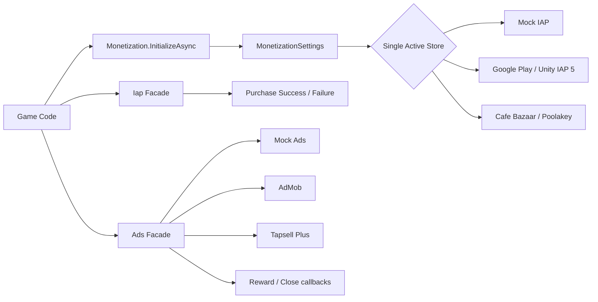

<div align="center">

# 💰 Unity Monetization Framework v2

### One clean API for IAP + Ads across Unity projects

**Mock-first development • Unity IAP 5.x • Cafe Bazaar Poolakey • AdMob • Tapsell • Android-first**

[](#requirements)
[](com.aminhasanloo.monetization/CHANGELOG.md)
[](LICENSE)
[](#provider-status)
[](#architecture)

**Built by [Amin Hasanloo](https://github.com/AminHasanloo)**

</div>

---

## Why v2 exists

The first version proved the idea, but it also had several problems that should not survive in a production monetization layer: multiple store symbols could initialize several providers and overwrite each other, purchase event subscriptions made before initialization could be lost, Google Play used the old Unity IAP v4 listener API, AdMob mixed new and legacy APIs, and the Cafe Bazaar/Myket adapters contained placeholder classes that compiled without performing real billing.

**v2 is a correctness-first rewrite.** It keeps the simple facade, but makes provider selection deterministic, adds a fully working Editor mock flow, migrates real integrations to current APIs where implemented, and explicitly disables integrations that are not yet production-ready instead of pretending they work.

---

## ✨ Highlights

- **One active IAP store at runtime** instead of provider overwrite races.
- **Editor-safe Mock IAP + Ads** so the package works immediately without third-party SDKs or store accounts.
- **Async initialization** with `Monetization.InitializeAsync()` and `Iap.RestoreAsync()`.
- **Subscription-safe IAP events** even when listeners are registered before initialization.
- **Typed product catalog** with Consumable, NonConsumable, Subscription and store-specific IDs.
- **Unity IAP 5.x Google Play adapter** using `StoreController`, `FetchProducts`, `FetchPurchases` and `OnPurchasePending`.
- **Real Cafe Bazaar Poolakey adapter**, replacing the old no-op shim.
- **Modern AdMob lifecycle** using static `Load()`, `CanShowAd()` and rewarded `Show(Action<Reward>)`.
- **Ad network fallback facade** with load/readiness/show helpers.
- **Automatic bootstrap** when `initializeOnStartup` is enabled.
- **Safer migration guards** for Myket, legacy IronSource/LevelPlay and direct-client Zarinpal.
- **Inspector workflow** that manages Android scripting symbols without enabling unsupported adapters.

---

## Provider status

| Provider | v2.0 status | Notes |
|---|---:|---|
| **Mock IAP** | ✅ Ready | Works in Unity Editor with no external SDK |
| **Mock Ads** | ✅ Ready | Rewarded, interstitial and banner development flow |
| **Google Play IAP** | ✅ Updated | Unity IAP 5.x `StoreController` integration |
| **Cafe Bazaar** | ✅ Updated | Uses official **Poolakey Unity SDK** |
| **AdMob** | ✅ Updated | Current full-screen load/show lifecycle |
| **Tapsell Plus** | 🟡 Adapter retained | Requires current official Tapsell Plus SDK and real-device validation |
| **Myket** | 🧭 Roadmap | Fake v1 shim removed; official billing adapter planned |
| **Unity LevelPlay** | 🧭 Roadmap | Legacy `IronSource.Agent` adapter retired; new Ad Unit API adapter planned |
| **Zarinpal** | 🔒 Server-only roadmap | Unsafe direct-client verification retired |

> **Important:** vendor SDK integrations require their official SDK, dashboard configuration, valid test IDs/accounts and real-device/store testing before release. This repository update modernizes the implementation against current SDK architecture, but it does not claim that a live store transaction was executed from this GitHub editing session.

---

## Architecture



The game talks to stable facades. Provider-specific code stays behind adapters and scripting symbols.

---

## Requirements

- Unity **2021.3+**. Unity 2022 LTS and Unity 6 are the recommended targets for new projects.
- Unity IAP **5.x** is declared as a UPM dependency by the package.
- Android for Cafe Bazaar, Myket and the current Iran-focused store workflows.
- Official provider SDKs only for the networks/stores you enable.

---

## Installation

### Option A: Unity Package Manager from Git

In **Package Manager → Add package from git URL**, use:

```text
https://github.com/AminHasanloo/UnityMonetizationFramework.git?path=/com.aminhasanloo.monetization
```

Or add it to `Packages/manifest.json`:

```json
{
  "dependencies": {
    "com.aminhasanloo.monetization": "https://github.com/AminHasanloo/UnityMonetizationFramework.git?path=/com.aminhasanloo.monetization"
  }
}
```

### Option B: local package

Clone the repository and add the package folder from disk:

```text
com.aminhasanloo.monetization/
```

---

## 60-second Editor quick start

1. Open **Window → Monetization → Settings**.
2. Click **Create Settings Asset**.
3. Leave `Active Store = Mock` and `Use Mock Services In Editor = true`.
4. Add a product to the new `Products` catalog, for example `coins_100` as Consumable.
5. Import the **Monetization Demo** sample from Package Manager, or use the code below.

```csharp
using AminHasanloo.Monetization;
using AminHasanloo.Monetization.Ads;
using AminHasanloo.Monetization.IAP;
using UnityEngine;

public class ShopExample : MonoBehaviour
{
    async void Start()
    {
        Iap.OnPurchaseSucceeded += id => Debug.Log($"Purchased: {id}");
        Iap.OnPurchaseFailed += (id, error) => Debug.LogError($"{id}: {error}");

        await Monetization.InitializeAsync();

        Ads.Load(AdType.Rewarded, "reward_default");
        Ads.Load(AdType.Interstitial, "interstitial_default");
    }

    public void BuyCoins()
    {
        Iap.Purchase("coins_100");
    }

    public void ShowRewarded()
    {
        Ads.ShowRewarded(
            "reward_default",
            reward => Debug.Log($"Grant {reward.Amount} {reward.Type}"),
            () => Debug.Log("Rewarded closed"));
    }
}
```

With the default Editor mock, the purchase succeeds and the rewarded callback returns a mock reward. No store account is needed for development UI/gameplay wiring.

---

## Product catalog

v2 replaces the old flat `string[] productIds` approach with typed products:

| Field | Purpose |
|---|---|
| `id` | Stable ID used by your game code |
| `type` | Consumable / NonConsumable / Subscription |
| `googlePlayId` | Optional Google Play override |
| `cafeBazaarId` | Optional Cafe Bazaar override |
| `myketId` | Reserved Myket override |

If a store-specific ID is empty, the canonical `id` is used.

The old `productIds` array is retained as a hidden migration field. When the v2 product catalog is empty, old IDs are treated as consumables so existing projects do not instantly lose their catalog.

---

## Google Play IAP setup

v2 targets the **Unity IAP 5.x architecture** instead of the old `IStoreListener` flow.

1. Set `Active Store = GooglePlay`.
2. Enable Google Play in Monetization Settings.
3. Configure products in the catalog using the same IDs as Play Console, or add Google-specific overrides.
4. Click **Apply Android Scripting Define Symbols**.
5. The settings tool enables `STORE_GOOGLEPLAY`.
6. Build and test through an appropriate Google Play test track/account.

The adapter connects through `UnityIAPServices.StoreController()`, fetches products, fetches previous purchases, receives new purchases through `OnPurchasePending`, and confirms the purchase after the local fulfillment callback.

### Server-authoritative economies

The default adapter is suitable for straightforward local fulfillment. For valuable consumables, currencies or competitive economies, do not treat the client as the final authority. Send the receipt/order data to your backend, make the grant idempotent, persist the entitlement, then confirm the pending purchase. A first-class receipt verification pipeline is on the roadmap.

---

## Cafe Bazaar setup

v2 removes the old fake `BazaarIAB` placeholder classes and integrates with the official **Poolakey Unity SDK**.

1. Install Poolakey from Cafe Bazaar's official repository.
2. Set `Active Store = CafeBazaar`.
3. Enable Cafe Bazaar and paste your RSA public key if you use Poolakey security checking.
4. Configure product IDs and product types.
5. Click **Apply Android Scripting Define Symbols** to enable `STORE_CAFEBAZAAR`.
6. Use a Bazaar-compatible Android test environment/account for real purchase testing.

Consumables can be automatically consumed after a successful purchase. Non-consumables and subscriptions are surfaced again by restore/fetch logic.

Official SDK: [cafebazaar/PoolakeyUnitySdk](https://github.com/cafebazaar/PoolakeyUnitySdk)

---

## AdMob setup

1. Install the current Google Mobile Ads Unity plugin.
2. Enable AdMob in Monetization Settings.
3. Add Banner, Interstitial and Rewarded Ad Unit IDs.
4. Click **Apply Android Scripting Define Symbols** to enable `AD_ADMOB`.
5. Use Google's official test ad units while integrating.

The v2 adapter follows the modern full-screen lifecycle:

```text
Load → CanShowAd → Show → Close/Fail → Reload
```

Rewarded rewards are delivered through the `Show(...)` callback rather than the removed legacy reward event pattern.

---

## Tapsell Plus

The Tapsell Plus adapter remains available behind `AD_TAPSELL`. Install the current official Tapsell Plus Unity SDK, enter your zone IDs, apply define symbols, and validate each ad format on a real Android device before release.

The framework intentionally keeps the provider interface small, so this adapter can be upgraded without changing game-side code.

---

## Ads API

```csharp
await Monetization.InitializeAsync();

Ads.Load(AdType.Rewarded, "reward_default");
Ads.Load(AdType.Interstitial, "level_end");
Ads.Load(AdType.Banner, "home_banner");

if (Ads.IsRewardedReady("reward_default"))
{
    Ads.ShowRewarded("reward_default", reward =>
    {
        // Grant reward
    });
}

Ads.ShowInterstitial("level_end");
Ads.ShowBanner("home_banner");
Ads.HideBanner("home_banner");
Ads.DestroyBanner("home_banner");
```

When multiple ad adapters are compiled and enabled, the facade uses the first network that reports the requested ad as ready. A configurable waterfall/mediation policy is planned.

---

## Settings & scripting symbols

The Editor window owns Android symbols for supported v2 integrations:

```text
STORE_GOOGLEPLAY
STORE_CAFEBAZAAR
AD_ADMOB
AD_TAPSELL
```

It deliberately removes the obsolete `AD_IRONSOURCE`, `STORE_MYKET` and `PAY_ZARINPAL` symbols instead of enabling unvalidated or unsafe legacy adapters.

---

## What was wrong in v1 and how v2 fixes it

| v1 issue | v2 fix |
|---|---|
| Several store symbols could initialize sequentially | Exactly one `activeStore` |
| Explicit initialize was gated by `initializeOnStartup` | Manual initialize always works |
| `initializeOnStartup` had no actual bootstrap | Runtime auto bootstrap added |
| Early IAP event subscriptions could disappear | Facade retains subscribers before provider init |
| Google Play used Unity IAP v4 APIs | Migrated to IAP 5.x `StoreController` |
| AdMob used removed legacy request/reward APIs | Migrated to current load/show model |
| Cafe Bazaar compiled against dummy no-op classes | Real Poolakey adapter |
| Myket compiled against dummy no-op classes | Fake shim removed, fail-fast migration guard |
| Zarinpal merchant/payment verification lived in client | Client flow retired; backend required |
| Legacy `IronSource.Agent` API remained | Retired pending LevelPlay Ad Unit implementation |

---

## Security checklist

- Never ship store private secrets or payment gateway verification credentials in the client.
- Use official store SDKs and test tracks/accounts.
- Make purchase fulfillment idempotent.
- Persist valuable consumable grants on a backend before acknowledging/confirming when your economy requires it.
- Validate receipts/server notifications for high-value products.
- Use AdMob test IDs during development.
- Ask for consent and configure privacy flags appropriate to your regions and ad providers.
- Do not assume a compile-successful adapter equals a production-tested payment flow.

---

## Repository layout

```text
com.aminhasanloo.monetization/
├── Runtime/
│   ├── Ads/
│   │   ├── IAdNetwork.cs
│   │   ├── AdsManager.cs
│   │   └── Adapters/
│   │       ├── MockAdNetwork.cs
│   │       ├── AdMobAdapter.cs
│   │       ├── TapsellAdapter.cs
│   │       └── IronSourceAdapter.cs   # migration notice only
│   ├── IAP/
│   │   ├── Interfaces.cs
│   │   ├── Monetization.cs
│   │   └── Providers/
│   │       ├── MockIapProvider.cs
│   │       ├── GooglePlayIapProvider.cs
│   │       ├── CafeBazaarIapProvider.cs
│   │       ├── MyketIapProvider.cs    # fail-fast migration guard
│   │       └── ZarinpalProvider.cs    # security migration guard
│   └── Settings/
│       └── MonetizationSettings.cs
├── Editor/
│   └── MonetizationSettingsWindow.cs
├── Samples~/Demo/
├── Plugins/Android/
├── CHANGELOG.md
└── package.json
```

---

## Contributing

PRs are welcome, especially for provider adapters, receipt validation, tests, consent flows and Android store integrations. For provider changes, please include:

- SDK/plugin version used
- Unity version used
- platform/device used
- test account/environment
- ad/purchase format tested
- any required Android manifest/Gradle configuration

This keeps the repo from drifting back into "it compiles, therefore it works" territory. 🧪

---

## License

MIT. Use it, extend it, ship it, and contribute improvements back when useful.

---

# 🗺️ Future Roadmap

The v2.0 goal is a trustworthy core. The next releases can turn it into a more complete monetization platform:

### v2.1 • Provider completion
- [ ] **Official Myket Billing Unity adapter** with consumable/non-consumable/subscription restore flows
- [ ] **Unity LevelPlay 9+ adapter** using `LevelPlay.Init` and Rewarded/Interstitial/Banner Ad Unit APIs
- [ ] Validate and refresh **Tapsell Plus** against the latest SDK with demo scene and test matrix
- [ ] iOS App Store provider validation through Unity IAP 5.x
- [ ] Per-platform store selection and product ID overrides

### v2.2 • Production purchase security
- [ ] Server-authoritative purchase pipeline
- [ ] Google Play receipt/order verification service example
- [ ] Cafe Bazaar server verification example
- [ ] Secure **Zarinpal backend checkout adapter** with server-owned prices and verification
- [ ] Idempotency keys, transaction ledger and retry-safe fulfillment
- [ ] Pending/deferred purchase UI states

### v2.3 • Smarter ads
- [ ] Configurable network priority / waterfall
- [ ] Automatic fallback when a network has no fill
- [ ] Frequency caps and cooldowns per placement
- [ ] App Open Ads
- [ ] MREC / adaptive banners
- [ ] Impression-level revenue callbacks
- [ ] Remote ad placement configuration

### v2.4 • Analytics & LiveOps
- [ ] Monetization event bridge for Analytics Lite / Firebase / custom analytics
- [ ] ARPDAU, payer conversion and ad revenue event schema
- [ ] Remote Config integration for prices, placements and experiments
- [ ] A/B testing hooks
- [ ] Player segmentation and personalized monetization rules

### v2.5 • Tooling & quality
- [ ] Automated Editor validation dashboard for missing IDs/SDKs/defines
- [ ] Unity Test Framework coverage for core + mock providers
- [ ] CI compile matrix across supported Unity versions
- [ ] Sample shop UI and rewarded-ad demo scene
- [ ] UPM release tags + GitHub Releases
- [ ] API documentation site
- [ ] Migration assistant from v1 settings to v2 catalog

### Long-term
- [ ] Server-driven economy catalog
- [ ] Subscription entitlement service
- [ ] Promotional offers / coupons
- [ ] Cross-store purchase abstraction
- [ ] Fraud/risk signals
- [ ] Consent management abstraction for GDPR/COPPA/region-specific policies
- [ ] Monetization health dashboard inside the Unity Editor

> The direction is simple: keep game-side code stable while stores, ad SDKs and payment systems change underneath it.
